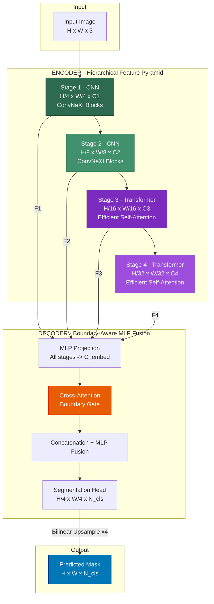
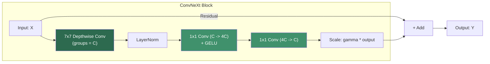
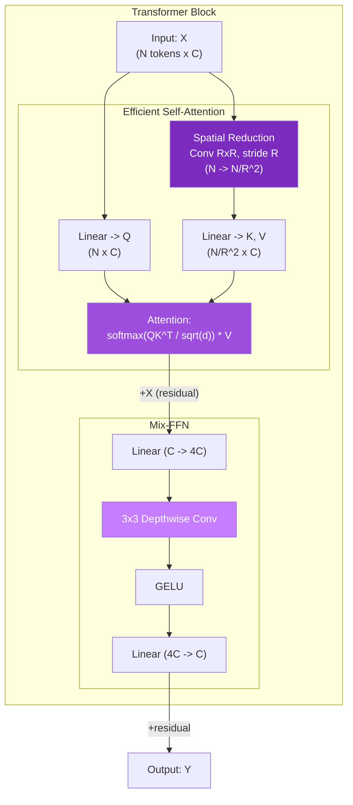
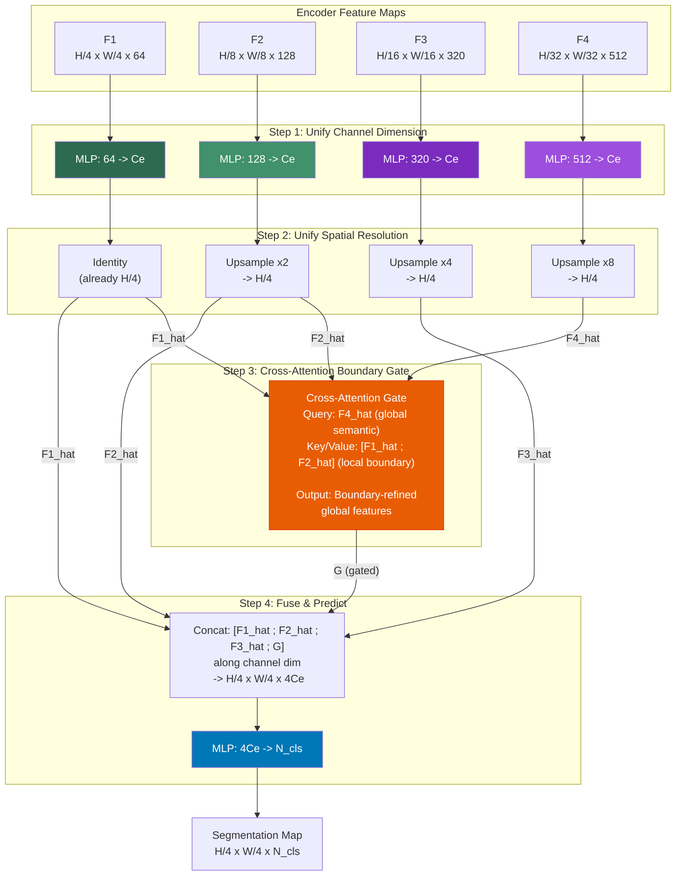
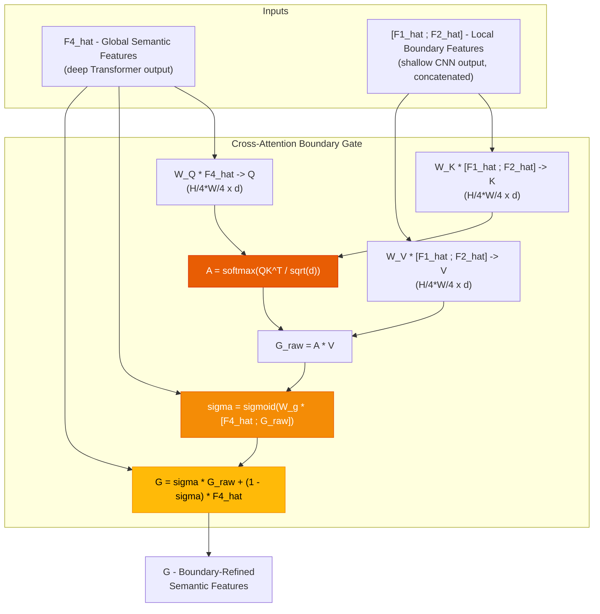
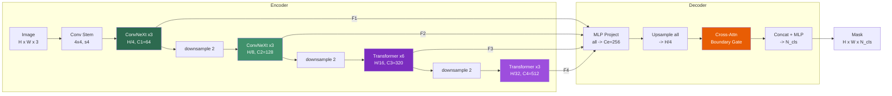
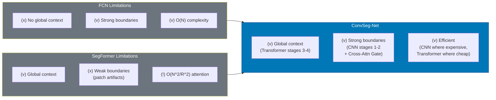

# ConvSeg-Net: A Hybrid CNN-Transformer Architecture for Semantic Segmentation

## 1. Motivation & Design Philosophy

Modern semantic segmentation demands two complementary capabilities:

| Capability | Best Modeled By | Why |
|---|---|---|
| **Local boundary & texture extraction** | CNNs (ConvNeXt blocks) | Translation equivariance, strong inductive bias, $O(N)$ complexity |
| **Global semantic reasoning** | Transformers (Self-Attention) | Unbounded receptive field, dynamic content-based routing |

> [!IMPORTANT]
> **Core Insight**: CNNs excel at high-resolution early stages where spatial detail matters, while Transformers excel at low-resolution deep stages where global context matters. ConvSeg-Net exploits this by placing each where it is most effective *and* most computationally efficient.

---

## 2. High-Level Architecture

---

## 3. Encoder — Detailed Specification

### 3.1 Stage Configuration

| Stage | Resolution | Channels ($C_i$) | Block Type | Num Blocks | Downsampling |
|:---:|:---:|:---:|:---:|:---:|:---:|
| 1 | $\frac{H}{4} \times \frac{W}{4}$ | 64 | ConvNeXt | 3 | Patch Embed (4×4 conv, stride 4) |
| 2 | $\frac{H}{8} \times \frac{W}{8}$ | 128 | ConvNeXt | 3 | 2×2 conv, stride 2 |
| 3 | $\frac{H}{16} \times \frac{W}{16}$ | 320 | Transformer | 6 | 2×2 conv, stride 2 |
| 4 | $\frac{H}{32} \times \frac{W}{32}$ | 512 | Transformer | 3 | 2×2 conv, stride 2 |

### 3.2 ConvNeXt Block (Stages 1 & 2)

Each block follows the modernized ConvNeXt design:

**Mathematically:**

$$Y = X + \gamma \cdot \text{Conv}_{1\times1}\Big(\text{GELU}\big(\text{Conv}_{1\times1}(\text{LN}(\text{DWConv}_{7\times7}(X)))\big)\Big)$$

where $\gamma$ is a learnable per-channel scale initialized to $10^{-6}$.

> [!TIP]
> The 7×7 depthwise convolution provides a large receptive field at minimal parameter cost (only $49 \times C$ parameters vs. $49 \times C^2$ for standard convolution). This is critical for capturing object boundaries at high resolution.

---

### 3.3 Efficient Self-Attention Block (Stages 3 & 4)

We use **Spatial-Reduction Attention (SRA)** from SegFormer to keep attention tractable:

**Spatial Reduction Attention (SRA):**

$$Q = XW_Q, \quad K = \text{Reshape}(X, \frac{N}{R^2}) \cdot W_K, \quad V = \text{Reshape}(X, \frac{N}{R^2}) \cdot W_V$$

$$\text{SRA}(Q, K, V) = \text{softmax}\left(\frac{QK^T}{\sqrt{d_{head}}}\right) V$$

| Stage | Reduction Ratio $R$ | Effective Attention Tokens | Complexity |
|:---:|:---:|:---:|:---:|
| 3 | 2 | $N/4$ | $O(N \cdot N/4) = O(N^2/4)$ |
| 4 | 1 | $N$ (full) | $O(N^2)$, but $N$ is only $\frac{HW}{1024}$ |

**Mix-FFN** (replaces positional encoding):

$$Y = \text{MLP}\big(\text{GELU}(\text{DWConv}_{3\times3}(\text{MLP}(X)))\big) + X$$

> [!NOTE]
> The 3×3 depthwise convolution inside the FFN implicitly encodes positional information (as shown in SegFormer), eliminating the need for explicit positional embeddings and enabling arbitrary input resolutions at inference time.

---

## 4. Decoder — Boundary-Aware MLP Fusion

This is the **novel contribution** over both FCN and SegFormer.

### 4.1 Full Decoder Pipeline

> [!NOTE]
> **Why the decoder is intentionally asymmetric:**
> - $\hat{F}_1$ and $\hat{F}_2$ are shallow CNN features, so they are used as local boundary cues for $K,V$ in the gate.
> - $\hat{F}_4$ is the deep semantic query and is already mixed into $G$ via residual gating, so concatenating raw $\hat{F}_4$ again would be redundant.
> - $\hat{F}_3$ is fused directly as a mid-level semantic feature; excluding it from the gate keeps gate compute focused on boundary refinement.
> - This design matches Section 4.2 equations and preserves the $4C_e$ fusion width in Step 4.

### 4.2 Cross-Attention Boundary Gate (Novel Component)

This is the key innovation: **global semantics selectively attend to local boundaries**.

**Mathematical Formulation:**

$$Q = \hat{F}_4 W_Q, \quad K = [\hat{F}_1 \| \hat{F}_2] W_K, \quad V = [\hat{F}_1 \| \hat{F}_2] W_V$$

$$A = \text{softmax}\left(\frac{QK^T}{\sqrt{d}}\right), \quad G_{\text{raw}} = A \cdot V$$

$$\sigma = \text{sigmoid}\big(W_g \cdot [\hat{F}_4 \| G_{\text{raw}}]\big)$$

$$G = \sigma \odot G_{\text{raw}} + (1 - \sigma) \odot \hat{F}_4$$

> [!IMPORTANT]
> **Why Cross-Attention instead of simple concatenation?**
> - **FCN** concatenates or adds skip connections blindly — all local features are equally weighted.
> - **SegFormer** discards explicit skip logic — the MLP decoder has no mechanism to selectively refine boundaries.
> - **ConvSeg-Net's Gate** lets the Transformer's global understanding *query* the CNN's boundary maps, selectively amplifying edges that correspond to real semantic boundaries (e.g., object contours) while suppressing irrelevant texture edges (e.g., grass texture).

---

## 5. Complete Forward Pass — Summary

---

## 6. Computational Complexity Analysis

| Component | Complexity | Justification |
|---|---|---|
| Stage 1 (CNN, H/4) | $O(HW \cdot C_1 \cdot k^2)$ | Depthwise conv is $O(N)$ in spatial dims |
| Stage 2 (CNN, H/8) | $O(\frac{HW}{4} \cdot C_2 \cdot k^2)$ | 4× fewer spatial tokens |
| Stage 3 (Transformer, H/16) | $O\left(\frac{H^2W^2}{256} \cdot \frac{C_3}{R^2}\right)$ | SRA reduces K,V by $R^2=4$ |
| Stage 4 (Transformer, H/32) | $O\left(\frac{H^2W^2}{1024} \cdot C_4\right)$ | Full attention, but only $\frac{HW}{1024}$ tokens |
| Cross-Attention Gate | $O\left(\frac{HW}{16} \cdot C_e \cdot 2\right)$ | Q from F₄ (small), K/V from F₁∪F₂ (large but linear projection) |
| MLP Decoder | $O\left(\frac{HW}{16} \cdot 4C_e \cdot N_{cls}\right)$ | Single linear projection |

**Total**: Asymptotically comparable to SegFormer-B2 but with stronger local feature extraction from the CNN stem.

---

## 7. Model Variants

| Variant | $C_1$–$C_4$ | Blocks per Stage | Params (est.) | Target |
|:---:|:---:|:---:|:---:|:---:|
| **ConvSeg-T** (Tiny) | 32-64-160-256 | 2-2-4-2 | ~6M | Mobile / Edge |
| **ConvSeg-S** (Small) | 64-128-320-512 | 3-3-6-3 | ~25M | Standard benchmark |
| **ConvSeg-B** (Base) | 64-128-320-512 | 3-3-18-3 | ~45M | High accuracy |
| **ConvSeg-L** (Large) | 96-192-384-768 | 3-3-27-3 | ~85M | SOTA push |

---

## 8. Training Recipe (Recommended)

| Hyperparameter | Value |
|---|---|
| Optimizer | AdamW |
| Learning Rate | $6 \times 10^{-5}$ (encoder), $6 \times 10^{-4}$ (decoder) |
| LR Schedule | Polynomial decay, power 1.0 |
| Weight Decay | 0.01 |
| Batch Size | 16 (8 GPUs × 2) |
| Augmentation | Random resize (0.5–2.0), crop 512×512, flip, PhotoDistort |
| Loss | Cross-Entropy + Lovász-Softmax (boundary-aware) |
| Pretraining | ImageNet-1K supervised (encoder only) |
| Fine-tune Epochs | 160K iterations |

---

## 9. Design Rationale vs. Prior Work

---

## 10. Key Novelty Claims

1. **Compute-Optimal Placement**: CNNs at high-resolution stages (where attention is $O(N^2)$ expensive) and Transformers at low-resolution stages (where convolutions have limited receptive fields).

2. **Cross-Attention Boundary Gate**: A learnable, content-dependent fusion mechanism that replaces both FCN's blind skip connections and SegFormer's flat concatenation. Deep semantic features *query* shallow boundary features, producing boundary-refined semantic maps.

3. **Positional-Encoding-Free Design**: The Mix-FFN's depthwise convolution provides implicit positional information, enabling variable input resolution at test time without interpolating positional embeddings.

---

## Open Questions for Review

> [!WARNING]
> **Attention Cost in Decoder**: The Cross-Attention Gate operates at H/4 × W/4 resolution. For a 512×512 input, that's 16,384 query tokens attending to 16,384 key tokens. Should we apply spatial reduction here too (e.g., reduce K/V by 4×)?

> [!IMPORTANT]
> **Pretraining Strategy**: Should stages 1-2 be initialized from a pretrained ConvNeXt, and stages 3-4 from a pretrained SegFormer encoder? Or should the whole encoder be trained jointly from scratch on ImageNet?

> [!NOTE]
> **Loss Function**: The Lovász-Softmax loss is boundary-aware and directly optimizes IoU. Is this redundant with the Cross-Attention Boundary Gate, or complementary?
